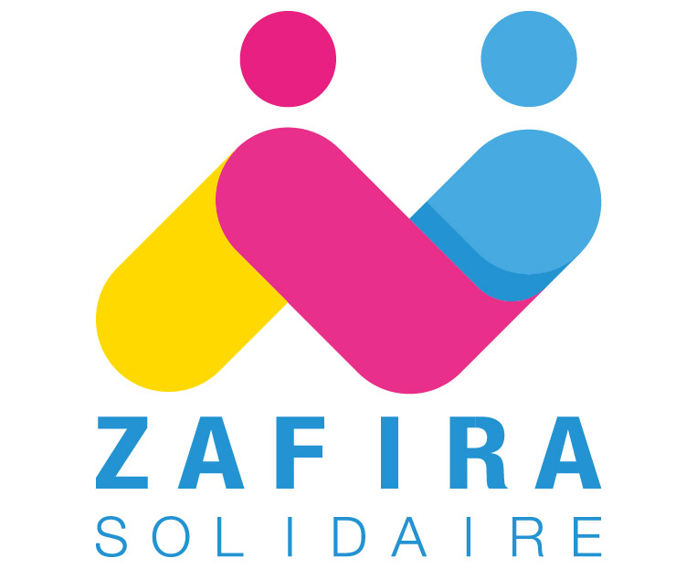
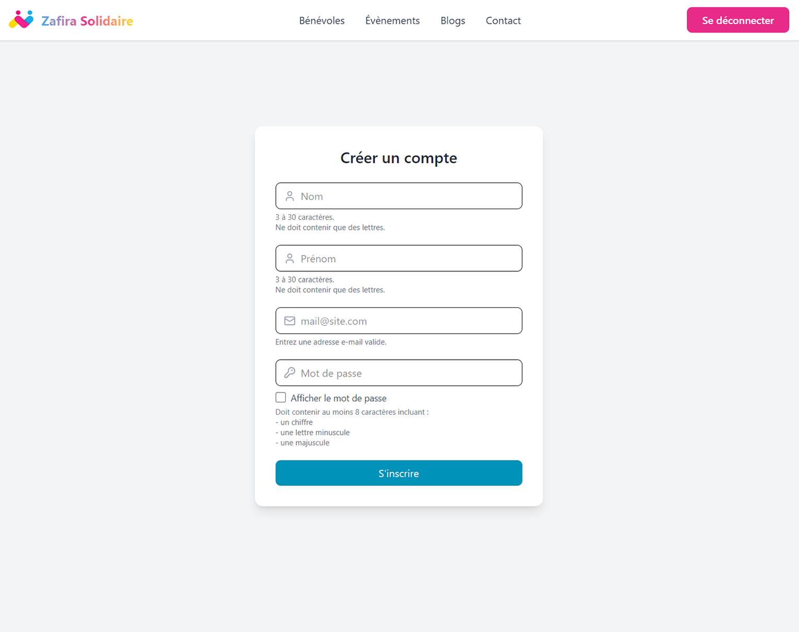
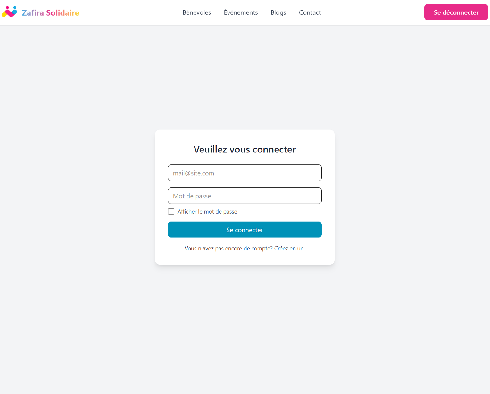
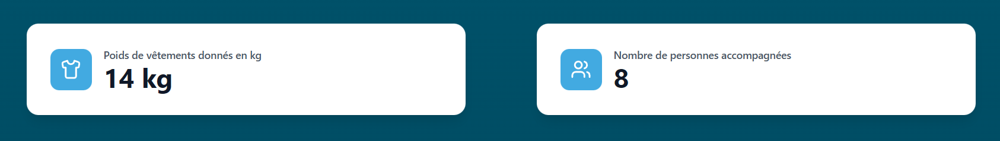

<!-- =========================== -->
<!-- 0. INTRO SECTION -->
<!-- =========================== -->

  
  
  <em>This project was born from the desire to  provide Zafira Solidaire a website to act as both a showcase and a technical hub.</em>

  

    <a href="#features">Features</a> •
    <a href="#about">About</a> •
    <a href="#contributors">Contributors</a>
  

---

## 🧩 Features {#features}

### ✨ Feature 1 — *Login using JWT and refresh tokens*

  

    
  

  

    
  

**Description:**
When a user logs in, they are issued both a **JWT** — a token containing their identity and role — and a **refresh token**. This setup allows for seamless navigation without requiring reauthentication every 30 minutes, while still ensuring secure, role-based access throughout the application.

---

### ⚡ Feature 2 — *Admin dashboard*

  <video width="900" controls>
    <source alt="admin dashboard video" src="https://github.com/Theo-D/Theo-D.github.io/raw/refs/heads/main/assets/dashboard_presentation.mp4">
  </video>

**Description:**
The **Admin Dashboard** enables the website administrator to perform CRUD operations on the business entities managed by the Spring Boot backend — including Users, Events, Clothing, and Partners. It also provides access to **Strapi**, an external service used to create and manage blog posts.

---

### 🚀 Feature 3 — *Metrics tracking*

  

**Description:**
As an association, **Zafira Solidaire** needed a way to showcase its impact. This was achieved by adding two dynamic counters to the website’s front page, allowing visitors to see in real time both the number of people assisted by the association and the total quantity of professional clothing delivered and processed for beneficiaries.

---

## 🧠 About {#about}

### 💡 Inspiration & Story
Born from the realization that people from different backgrounds are not equally equipped to face the hiring process, **Zafira Solidaire** was created to help alleviate some of the challenges these individuals encounter.

To achieve this, the association provides **professional clothing**, **image consulting**, **photo shoots**, and other services designed to ease access to the job market for those who need it — primarily young adults aged 16 to 25.

To fulfill its mission, it soon became clear that the association needed a website to showcase its achievements to potential partners and beneficiaries, enable members to book appointments and register for workshops, and support the organization in managing its activities.

---

### 👥 Contributors {#contributors}

| Name | GitHub | LinkedIn |
|------|---------|----------|
| Théo DESSAIGNE| [GitHub](https://github.com/Theo-D) | [LinkedIn](www.linkedin.com/in/théo-dessaigne-bb0483373) |
| Ancelin CHEVALLIER| [GitHub](https://github.com/Ancelin-31) | To be Done |

---

### 🛠️ Tech Stack

- **Frontend:** React
- **Backend:** Spring Boot
- **Database:** MySQL
- **External Service:** Strapi

---

  
Thank you for checking out project's landing page!

